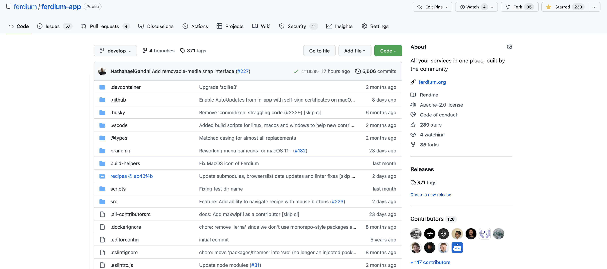
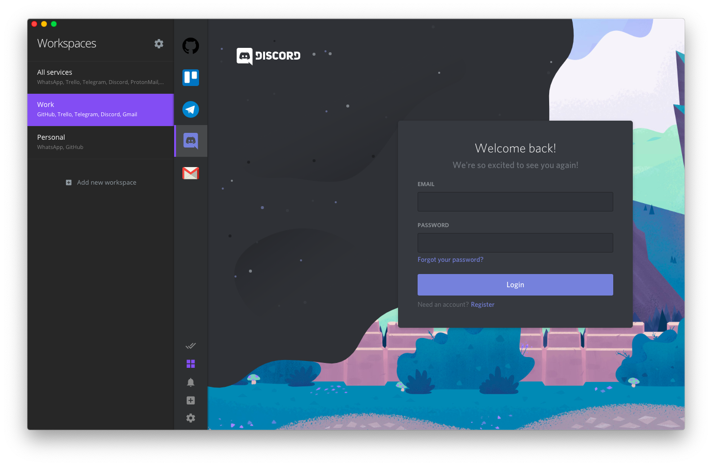
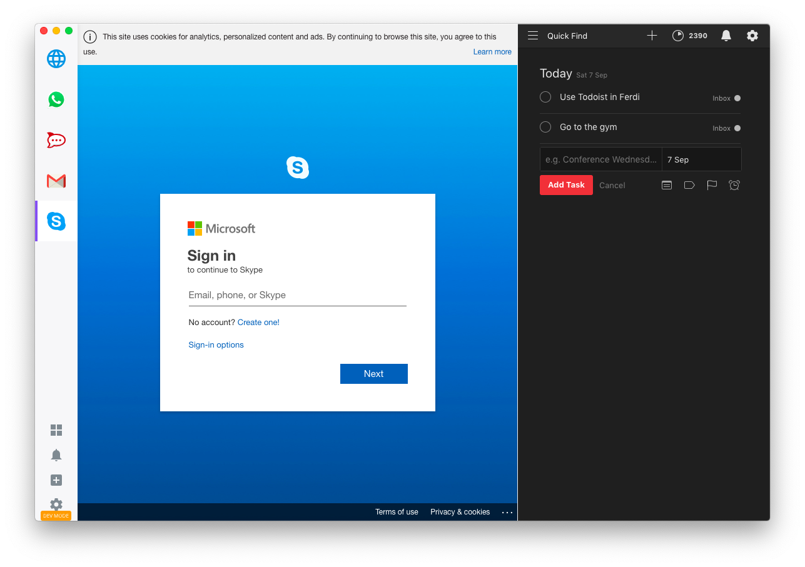
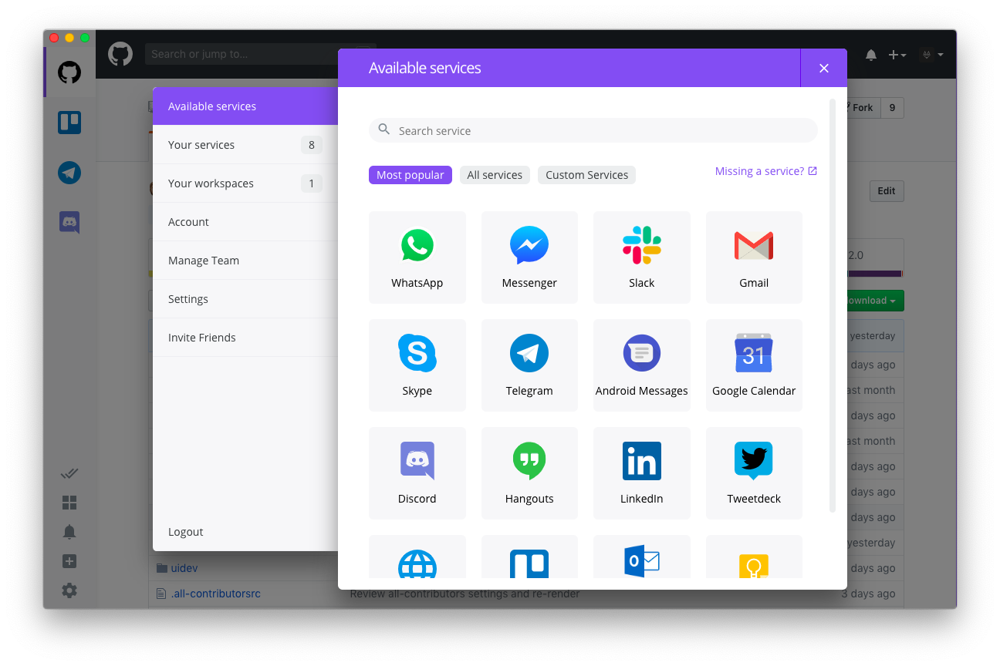

    

    

# FreeTrans

FreeTrans 是一款面向聊天软件的桌面翻译工具。它在 Ferdium 提供的多服务工作区中加入消息翻译能力，帮助你阅读收到的外语消息，并在发送前将内容翻译成对方使用的语言。

[项目主页与源代码](https://github.com/gcc-luo/FreeTrans) · [问题反馈](https://github.com/gcc-luo/FreeTrans/issues) · [桌面版本下载](https://github.com/gcc-luo/FreeTrans/releases)

## 翻译功能

- **接收消息翻译**：为支持的聊天服务设置目标语言，并查看消息翻译结果。
- **发送前翻译**：输入消息后自动翻译，再发送到当前聊天服务。
- **按服务配置**：分别设置翻译引擎、目标语言，以及收发消息翻译开关。
- **多种翻译引擎**：支持 Google、百度、LibreTranslate 和 MyMemory；实际可用性取决于所选引擎的网络服务和账号配置。

## 下载与更新

FreeTrans 的 macOS 和 Windows 桌面安装包可在 [GitHub Releases](https://github.com/gcc-luo/FreeTrans/releases) 获取。应用内更新也从该发布源检查新版本。

## 关于上游项目

FreeTrans 基于开源项目 [Ferdium](https://github.com/ferdium/ferdium-app) 开发，保留了其多服务工作区、服务管理和桌面集成等能力，并在此基础上加入聊天消息翻译功能。感谢 Ferdium 及其贡献者提供的开源基础。

以下内容介绍的是从上游项目继承的功能与兼容说明。

## 截图

工作区与服务管理界面

## 从 Ferdi 迁移

如果您是 Ferdi 的现有用户，并考虑切换到 Ferdium，您可能需要运行[以下脚本](./scripts/migration)来迁移您现有的 Ferdi 配置文件，以便 Ferdium 可以读取这些配置。（.ps1 适用于 PowerShell/Windows 用户，.sh 适用于 UNIX（Linux 和 MacOS）用户）。更详细的说明，请参阅 [迁移指南.md](docs/迁移指南.md)

## 样式定制

您可以使用 `USER_DATA/Ferdium/config/custom.css` 文件来自定义 Ferdium 的用户界面。

> **注意**
>
> `USER_DATA` 的位置取决于您的平台：
>
> - **Windows**: `%APPDATA%`
> - **Linux**: `$XDG_CONFIG_HOME` 或 `~/.config/`
> - **MacOS**: `~/Library/Application Support`

## 贡献

请阅读[贡献指南](贡献指南.md)以设置您的开发环境并开始贡献。
